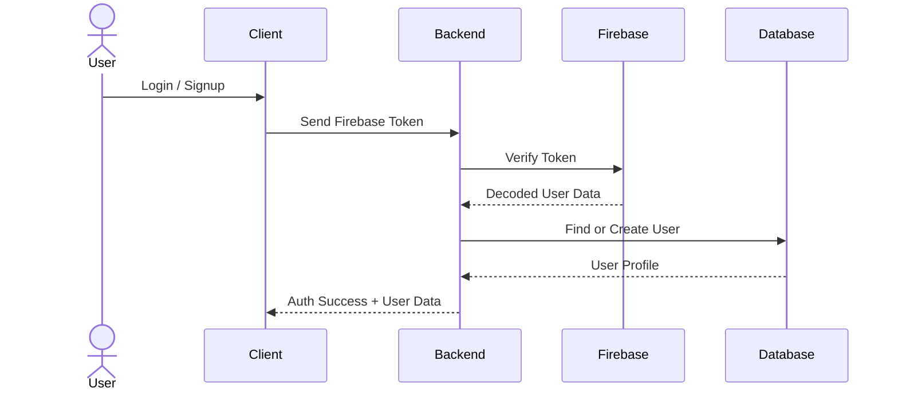

# Auth Module Flow

This module handles user authentication and authorization using Firebase + Backend + Database.

---

## 1. Authentication Flow (Sign Up / Sign In)

```mermaid
sequenceDiagram
    actor User
    participant Client
    participant Backend
    participant Firebase
    participant Database

    User->>Client: Login / Signup
    Client->>Backend: Send Firebase Token

    Backend->>Firebase: Verify Token
    Firebase-->>Backend: Decoded User Data

    Backend->>Database: Find or Create User
    Database-->>Backend: User Profile

    Backend-->>Client: Auth Success + User Data
```
