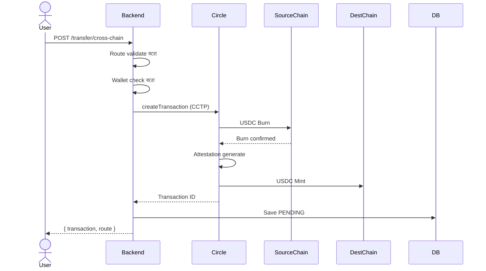

# Transfer Module Flow

## CCTP Cross-chain Flow

```mermaid
sequenceDiagram
    actor User
    participant Backend
    participant Circle
    participant SourceChain
    participant DestChain

    User->>Backend: POST /transfer/cross-chain
    Backend->>Backend: Route validate করো
    Backend->>Backend: Wallet check করো
    Backend->>Circle: createTransaction (CCTP)
    Circle->>SourceChain: USDC Burn
    SourceChain-->>Circle: Burn confirmed
    Circle->>Circle: Attestation generate
    Circle->>DestChain: USDC Mint
    Circle-->>Backend: Transaction ID
    Backend->>DB: Save PENDING
    Backend-->>User: { transaction, route }
```
